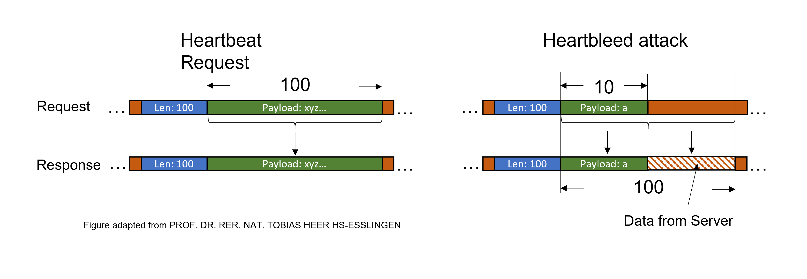
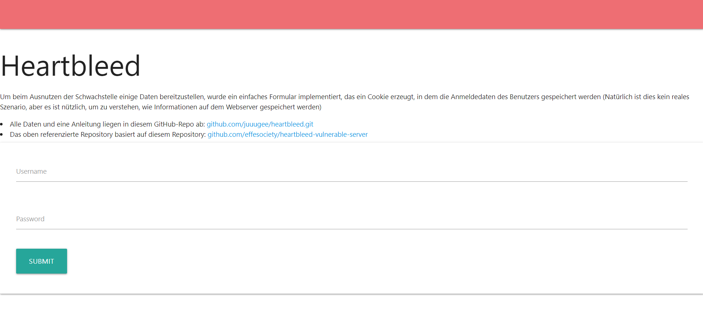

# Heartbleed
## Setup
Debian + Apache2 + OpenSSL (V. 1.0.1) based on https://github.com/effesociety/heartbleed-vulnerable-server <br>
exploit based on: https://github.com/jknudsen-synopsys/heartbleed-box

Requirements:
- Docker
- git
- python

#
## Description of vulnerability
The Heartbleed bug occurs in versions 1.0.1 to 1.0.1f of the open source library OpenSSL. This library is used to generate and manage certificates. In addition, this library is used for encryption.  <br>
Within this library there is the Heartbeat function. With this, a request is sent and the server should respond with the exact identical packet. The length of the payload and the actual payload must be specified. However, no comparison is made between the actual payload length and the specified length. This allows additional data to be retrieved from the server. <br>

To exploit the Heartbleed bug, it is necessary to establish a connection via TLS beforehand. This requires a handshake between the attacker and the server. A Heartbleed packet can then be sent to the server. The Heartbleed packet is shown below: <br>
```
18    # Content type = 18 (Heartbeat message)
03 02 # Version
00 03 # Packet length
01    # Heartbeat message type (1 = request)
FF FF # Payload length
      # There is no actual message, just an empty string
```
(Source: https://security.cs.pub.ro/summer-school/wiki/session/extra/heartbleed-poc) 
#
## Heartbleed Vulnerable Server
A Debian (Wheezy) Linux system with a vulnerable version of libssl and openssl and a web server to showcase CVS-2014-0160, a.k.a. Heartbleed.

#
## Overview
This docker container is based on Debian Jessie and has been modified to use a vulnerable version of libssl and openssl.




#
## Installation

1. clone this git repository 
```bash 
git clone https://github.com/juuugee/heartbleed.git
 ```
2. navigate inside the cloned directory
```bash 
cd heartbleed/
 ```

3. build docker container: 
``` bash
docker build -t seccode/heartbleed .
```
4. run docker container: 
``` bash
docker run -itd -p 8443:443 --name secode_heartbleed seccode/heartbleed
``` 
To make sure that the docker container is running, enter the following url in a browser (important https): 
``` bash
https://localhost:8443
```


#
## Exploitation

1. Open 
``` bash
https://localhost:8443
```
2. Log in with fictional credentials

3. Start the exploit:
send a Heartbleed request to the vulnerable web server
``` bash
 python -m exploit.py
```